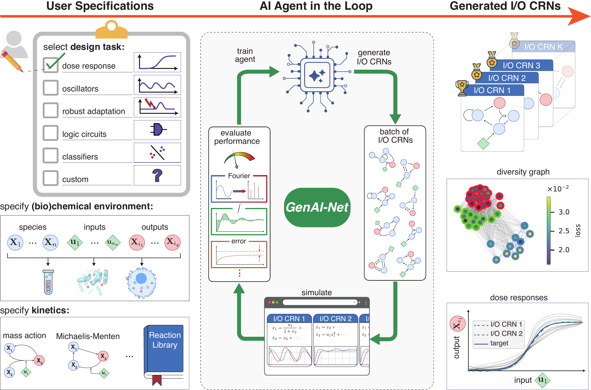

# GenAI-Net (RL4CRN)

Implementation of [**GenAI-Net**](https://www.arxiv.org/abs/2601.17582): a generative reinforcement-learning framework for designing **input–output chemical reaction networks (IO-CRNs)** by sequentially composing reactions from a library and optimizing performance objectives.

**Documentation:** see the rendered docs in **`docs/`** (built with MkDocs) — start from the **Docs Home / Overview** page.

---

## What this repository contains

GenAI-Net learns *policies over reaction-network edits* (e.g., “add reaction #j with these parameters”) and evaluates candidate IO-CRNs via deterministic and/or stochastic simulation, using task-specific reward functions (tracking, oscillation, logic, relationship constraints, etc.). The codebase is organized around:

- **IO-CRN representations** and simulation backends (`RL4CRN/iocrns/`)
- **Agent/environment interfaces** (`env2agent_interface/`, `agent2env_interface/`)
- **RL agents and policies** (`agents/`, `policies/`, `value_functions/`)
- **Rewards** (`rewards/`)
- **Utilities + plotting** (`utils/`)
- Optional **NLP-based components** (`NLPAgent/`)

---

## Method at a glance (Figure 1)

Figure 1 provides the high-level GenAI-Net loop: the agent observes an IO-CRN state, proposes a reaction edit (structure + parameters), the environment compiles the updated network and simulates it, and a reward drives learning toward functional designs.



For a complete description (including Figure 2 and full method details), refer to the documentation.

---

## Documentation

- **Docs entry point:** `docs/index.md`
- **Reference/API pages:** `docs/reference/` (auto-generated from docstrings via `mkdocstrings`)
- **Build/preview locally:**
  ```bash
  mkdocs serve
  ```
  Then open the local URL printed in the terminal.

If you change docstrings and want the reference pages updated, rebuild the docs (or just refresh if using `mkdocs serve`).

---

## Installation

Clone the repository and install in editable mode:

```bash
git clone <YOUR_REPO_URL>
cd <YOUR_REPO_DIR>
pip install -e .
```

If you use a virtual environment (recommended):

```bash
python -m venv .venv
source .venv/bin/activate  # macOS/Linux
# .venv\Scripts\activate   # Windows
pip install -e .
```

---

## Quick start

A typical workflow is:

1. Define / load a reaction library and IO-CRN environment.
2. Choose an observer/tensorizer (environment → agent state).
3. Choose an actuator/stepper (agent action → environment edit).
4. Train an RL agent (e.g., PPO / REINFORCE) with a reward from `rewards/`.

The docs provide the recommended starting points and examples.

---

## Paper

This repository accompanies the GenAI-Net method described in:

- https://www.arxiv.org/abs/2601.17582

(Please cite the paper if you use this code in academic work; a BibTeX entry can be added here once finalized.)

---

## License

Add your license here (e.g., MIT/BSD-3/Apache-2.0).

---

## Notes on pycuda installation

To install pycuda in a venv, you have to export the following envirnomental varaibles:

```{bash}
export CC=/usr/bin/gcc
export CXX=/usr/bin/g++
# install with
python -m pip install --no-cache-dir --no-build-isolation pycuda
```

## Compiling the docs

You can compile the documentation for this project by collecting the necessary dependencies:

```
pip install .[docs]
```

and running 

```
python docs/gen_ref_pages.py & mkdocs serve 
```

which will create the documentation and serve it on the localhost:8000 port.