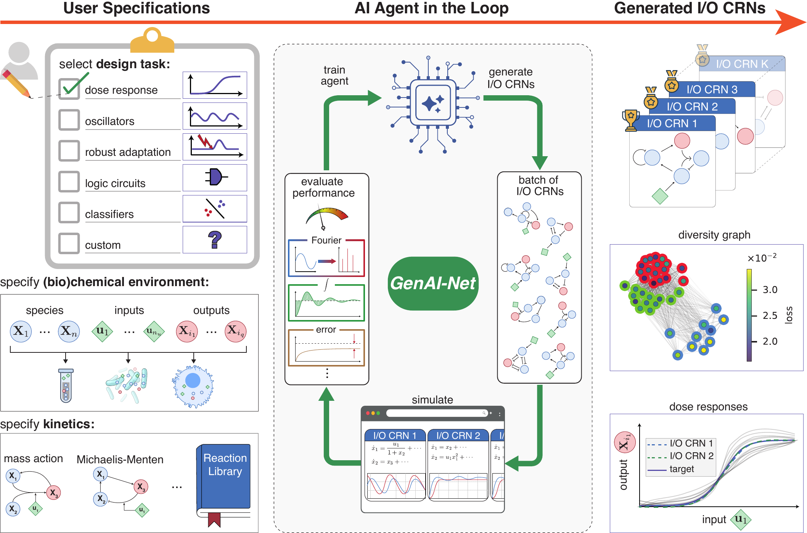

# GenAI-Net (RL4CRN)

Implementation of [**GenAI-Net**](https://www.arxiv.org/abs/2601.17582): a generative reinforcement-learning framework for designing **input–output chemical reaction networks (IO-CRNs)** by sequentially composing reactions from a library and optimizing performance objectives.

**Documentation:** [maurice-filo.github.io/GenAI-Net/](https://maurice-filo.github.io/GenAI-Net/).

> Please feel free to open a GitHub issue for any question related to the code, this will help us improving our method! 

---

## Overview

GenAI-Net learns *policies over reaction-network edits* (e.g., “add reaction #j with these parameters”) and evaluates candidate IO-CRNs via deterministic and/or stochastic simulation, using task-specific reward functions (tracking, oscillation, logic, relationship constraints, etc.). The codebase is organized around:

- **IO-CRN representations** and simulation backends (`RL4CRN/iocrns/`)
- **Agent/environment interfaces** (`env2agent_interface/`, `agent2env_interface/`)
- **RL agents and policies** (`agents/`, `policies/`, `value_functions/`)
- **Rewards** (`rewards/`)
- **Utilities + plotting** (`utils/`)
- Optional **NLP-based components** (`NLPAgent/`)

---

### Method at a glance

The high-level GenAI-Net loop: the agent observes an IO-CRN state, proposes a reaction edit (structure + parameters), the environment compiles the updated network and simulates it, and a reward drives learning toward functional designs.



---

## Installation

Clone the repository and install:

```bash
git clone <YOUR_REPO_URL>
cd <YOUR_REPO_DIR>
pip install .
```

If you use a virtual environment (recommended):

```bash
python -m venv .venv
source .venv/bin/activate  # macOS/Linux
# .venv\Scripts\activate   # Windows
pip install -e .
```

---

## Quick start

A typical workflow is:

1. Define / load a reaction library and IO-CRN environment.
2. Define the objective of the task (loss/reward).
3. Create a Trainer object, containing the hyperparameters for the RL loop.
4. Train and evaluate the results.

See the `apps` folder for 10 examples using GenAI-Net on different task. 

---

## Paper and citations

This repository accompanies the GenAI-Net method described in:

- https://www.arxiv.org/abs/2601.17582

```
@article{filo2026genai,
  title={GenAI-Net: A Generative AI Framework for Automated Biomolecular Network Design},
  author={Filo, Maurice and Rossi, Nicol{\`o} and Fang, Zhou and Khammash, Mustafa},
  journal={arXiv preprint arXiv:2601.17582},
  year={2026}
}
```

---

## License

This work is licensed under GPL 3.0.

---

## Notes on pycuda installation

To install pycuda in a venv, you have to export the following envirnomental varaibles:

```{bash}
export CC=/usr/bin/gcc
export CXX=/usr/bin/g++
# install with
python -m pip install --no-cache-dir --no-build-isolation pycuda
```

## Enabling SSA simulations

To run SSA simulations you need a cuda capable GPU. You can install the required dependencies via

```
pip install .[SSA]
```

## Compiling the docs

You can compile the documentation for this project by collecting the necessary dependencies:

```
pip install .[docs]
```

and running 

```
python docs/gen_ref_pages.py & mkdocs serve 
```

which will create the documentation and serve it on the localhost:8000 port.